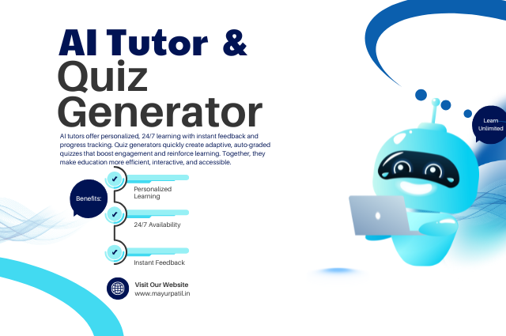

# 📚 Personalised Tutor – AI-Powered Tutor & Quiz App

An educational platform that leverages artificial intelligence to provide **personalized learning experiences**. This app allows users to ask questions on various academic subjects and receive tailored explanations, as well as generate quizzes to reinforce their understanding.



---

## 🚀 Project Overview

The **AI-Powered Tutor & Quiz App** offers:
- Adaptive tutoring based on user preferences
- Quiz generation for knowledge testing
- Multi-language and multi-subject support

---

## 🛠 Tools & Technologies

- **FastAPI** – Backend API framework  
- **Streamlit** – Frontend framework  
- **LangChain** – LLM orchestration  
- **OpenAI API** – Powers tutoring and quiz features  
- **Python** – Core programming language  
- **Pydantic** – Data validation  
- **Uvicorn** – ASGI server  
- **python-dotenv** – Environment variable management  

---

## 🏗 Architecture & Components

### 1. Streamlit Frontend (`app.py`)
- User interface for interacting with the app
- Collects user inputs like subject, learning style, etc.
- Displays personalized responses and quizzes

### 2. FastAPI Backend (`main.py`)
- RESTful endpoints for tutoring and quizzes
- Handles request validation and error responses
- Connects to the AI engine

### 3. AI Engine (`ai_engine.py`)
- Constructs LLM prompts based on user preferences
- Parses responses and includes fallback logic
- Adapts content to user learning styles

---

## 🔄 Workflow

1. User selects preferences in the Streamlit UI (subject, level, learning style, etc.)
2. User enters a question or quiz request.
3. Streamlit sends the request to the FastAPI backend.
4. Backend validates and forwards it to the AI engine.
5. AI engine constructs a prompt and queries OpenAI via LangChain.
6. Response is parsed and returned to the frontend.
7. Personalized content is displayed to the user.

---

## 🔍 Key Features

- **🎓 Personalized Learning** – Adapts content to user’s style, proficiency, and background
- **📚 Multi-Subject Support** – Includes Math, Physics, CS, History, Biology, Programming
- **📝 Quiz Generation** – Custom quizzes for active recall
- **🌐 Multi-Language Support** – English, Hindi, Spanish, French
- **🧠 Learning Style Adaptation** – Visual, Text-based, and Hands-on learning formats

---

## 🧩 Implementation Details

### Frontend
- Sidebar for selecting subject and learning style
- Text area for question input
- Buttons to trigger responses or quizzes
- Displays formatted AI-generated content

### Backend
- RESTful API endpoints
- Request validation via Pydantic
- CORS middleware enabled
- Error handling with HTTP codes

### AI Engine
- Dynamic prompt engineering
- Handles response formatting
- Built-in error fallback strategies

---

## 🚀 Getting Started

```bash
# 1. Install dependencies
pip install -r requirements.txt

# 2. Set up environment
# Add your OpenAI API key in a .env file

# 3. Start the backend
uvicorn main:app --reload

# 4. Launch the frontend
streamlit run app.py
```

---

## 📬 Contact
🌐 **Website**: [www.mayurpatil.in](https://www.mayurpatil.in)

